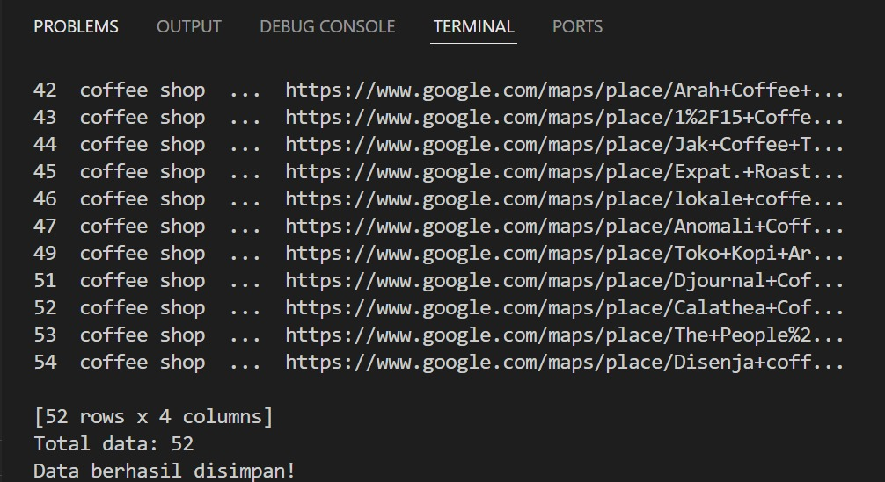
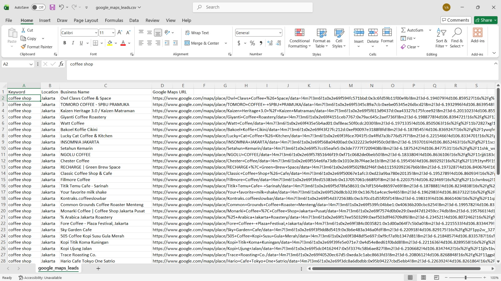

# Google Maps Lead Generator

## Overview
This project demonstrates automated lead generation scraping from Google Maps using Python Selenium.

The scraper automatically:
- Searches businesses based on keyword and location
- Scrolls dynamically loaded listings
- Extracts business information
- Exports structured datasets into CSV format

---

## Features
- Automated Google Maps search
- Dynamic scrolling handling
- Lead generation scraping
- Duplicate removal
- CSV export
- Structured business dataset

---

## Technologies Used
- Python
- Selenium
- Pandas
- WebDriver Manager

---

## Output
The scraper extracts:
- Keyword
- Location
- Business Name
- Google Maps URL

---

## Sample Output

| Keyword | Location | Business Name |
|---|---|---|
| coffee shop | Jakarta | Owl Claws Coffee & Space |

---

## Project Structure

```bash
google-maps-lead-generator/
│
├── GoogleMaps_Scrapper/
│   ├── data/
│   │   ├── google_maps_leads.csv
│   │   ├── Result.jpeg
│   │   └── ResultCsv.jpeg
│   │
│   └── googlemapsScraper.py
│
├── README.md
├── LICENSE
└── .gitignore
```

---

## Screenshots

### Terminal Result


### CSV Result

